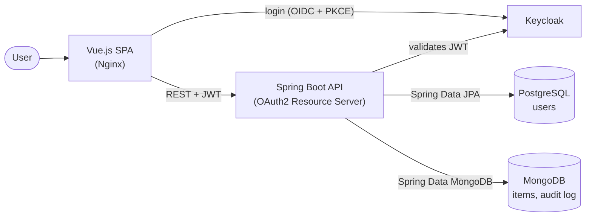

# Jamigos

A full-stack practice project for **security, persistence, testing and DevOps**: a Spring Boot backend secured with OAuth2/OIDC via Keycloak, a Vue.js frontend, two databases, and a GitHub Actions pipeline that builds, tests and deploys every part as a Docker container.

The application itself is deliberately minimal — users sign in, get a dashboard based on their role and manage items that belong to them. The point of the project is the engineering around it, not the feature set. It is not a finished product.

---

## Highlights

**Security**
- OAuth2/OIDC login via **Keycloak**: authorization code flow with PKCE in the frontend, the backend as an **OAuth2 Resource Server** validating Keycloak-issued JWTs.
- **Multiple `SecurityFilterChain`s** with different rules: public Swagger UI, Actuator behind basic auth (health endpoint public), and the API behind JWT authentication.
- Role mapping from the JWT's `realm_access.roles` to Spring authorities; **method security** with `@PostFilter` (users only see their own items) and `@PreAuthorize` (admin-only operations).
- **Ownership checks with AOP**: a custom `@RequireOwner` annotation and aspect verify that a user can only delete their own items.
- A **user-sync filter** that creates or updates the local user record from the JWT on each authenticated request.
- Custom Keycloak login theme.

**Persistence**
- **Spring Data JPA** with PostgreSQL for users, **Spring Data MongoDB** for items and the audit log.
- **Audit trail** written automatically by an AOP aspect on create and delete operations; a second aspect logs execution times.

**Testing**
- **Unit tests** for services (Mockito), **slice tests** for the repositories (`@DataJpaTest`, `@DataMongoTest`), **security tests** for the filter chains and method security, and **integration tests** with the full Spring context against real databases via **Testcontainers**.

**CI/CD and deployment**
- **GitHub Actions**: path-based change detection, so only the changed parts are built; build, lint and test; Docker images pushed to the **GitHub Container Registry** on push.
- **Deployment to Render** as three services — Vue.js frontend (Nginx), Spring Boot backend and Keycloak — each running its own image, defined in `render.yaml`. The hosted instance has since been taken down; the deployment setup is kept as part of the project.
- Spring profiles for `local`, `dev`, `test` and `prod`; Docker Compose setups for local development (databases, Keycloak, admin tools) and for running the published images.

**API**
- OpenAPI documentation with Swagger UI, integrated with Keycloak so endpoints can be tried out with a real token.
- Spring Boot Actuator for health checks.

## Architecture



The backend uses a layered structure: controllers, services and repositories, with security components and AOP aspects as cross-cutting concerns.

## Tech stack

| Layer | Technology |
|---|---|
| Backend | Java 25 · Spring Boot 3.5 · Spring Security · Spring Data JPA · Spring Data MongoDB · Spring AOP · Maven |
| Security | Keycloak · OAuth2/OIDC · JWT |
| Databases | PostgreSQL · MongoDB |
| Frontend | Vue 3 · Pinia · Vue Router · Vite · keycloak-js |
| API docs | springdoc-openapi · Swagger UI |
| Testing | JUnit 5 · Mockito · Testcontainers |
| CI/CD and hosting | GitHub Actions · Docker · Docker Compose · GitHub Container Registry · Render |

## Repository layout

| Path | Contents |
|---|---|
| [`backend/`](backend) | Spring Boot API |
| [`frontend/`](frontend) | Vue.js single-page application |
| [`keycloak-theme/`](keycloak-theme) | Custom Keycloak login themes |
| [`.github/workflows/`](.github/workflows) | CI/CD pipeline |
| `docker-compose-local.yml` | Local infrastructure: PostgreSQL, MongoDB, Keycloak, pgAdmin, Mongo Express |
| `docker-compose-dev.yml` | Runs the published backend and frontend images |
| `render.yaml` | Render deployment definition |

## Running locally

Prerequisites: Java 25, Node.js 20+, Docker.

```bash
# 1. Start PostgreSQL, MongoDB and Keycloak
docker compose -f docker-compose-local.yml up -d

# 2. Start the backend (http://localhost:8082)
cd backend
./mvnw spring-boot:run -Dspring-boot.run.profiles=local

# 3. In a second terminal, from the repository root: start the frontend (http://localhost:5173)
cd frontend
npm install
npm run dev
```

Keycloak needs a realm (`jamigos-realm`) with a public client (`jamigos-client`) that allows `http://localhost:5173/*` as a redirect URI. The backend validates tokens against `http://localhost:8180/realms/jamigos-realm`.

Run the backend tests (Docker must be running for Testcontainers):

```bash
cd backend
./mvnw test
```

## Authorship

The backend, the security and authentication setup, the persistence layer, the backend tests and the CI/CD pipeline were written by me.

The following parts were generated with AI assistance, as an experiment, and are not part of what this project demonstrates:

- the **mobile build** (Capacitor iOS/Android wrapper and its login flow),
- the **mobile Keycloak theme**,
- the **frontend unit tests** (Vitest),
- the later **UI restyling** of the web frontend (design system and theming).
